# Diagramme de Classes UML Détaillé - Alfred

**Application :** Alfred - Assistant d'écriture IA  
**Date :** 2025-01-13  
**Version :** 1.0

---

## Diagramme de Classes UML Détaillé

Le diagramme de classes UML détaillé représente le modèle métier complet de l'application Alfred avec tous les attributs, méthodes, visibilités et signatures complètes. Ce diagramme suit les standards UML académiques et permet la documentation de développement et la modélisation DDD détaillée.

### Diagramme PlantUML

```plantuml
@startuml Diagramme de Classes UML Détaillé - Alfred
!theme plain
skinparam linetype ortho
skinparam shadowing false
skinparam roundcorner 10
skinparam class {
    BackgroundColor<<Entity>> #E3F2FD
    BackgroundColor<<ValueObject>> #FFF3E0
    BackgroundColor<<Repository>> #E8F5E9
    BackgroundColor<<UseCase>> #F3E5F5
    BorderColor #1976D2
    ArrowColor #424242
}

' ============================================
' ENTITIES
' ============================================
package "Domain - Entities" <<Folder>> {
    
    class User <<Entity>> {
        --
        -id: string {readonly}
        -email: string
        -passwordHash: string
        -createdAt: Date {readonly}
        -updatedAt: Date
        --
        +validate(): void
        +comparePassword(password: string): Promise<boolean>
    }
    
    class Document <<Entity>> {
        --
        -id: string {readonly}
        -userId: string {readonly}
        -title: string
        -content: DocumentContent
        -style: WritingStyle
        -version: number
        -createdAt: Date {readonly}
        -updatedAt: Date
        -sortOrder: number
        -bookId: string | null
        -chapterOrder: number | null
        --
        +updateContent(newContent: DocumentContent): void
        +needsAIAnalysis(): boolean
        +validate(): void
        +updateSortOrder(order: number): void
        +assignToBook(bookId: string | null, chapterOrder: number | null): void
        +removeFromBook(): void
    }
    
    class Book <<Entity>> {
        --
        -id: string {readonly}
        -userId: string {readonly}
        -title: string
        -description: string | null
        -sortOrder: number
        -createdAt: Date {readonly}
        -updatedAt: Date
        --
        +updateTitle(newTitle: string): void
        +updateDescription(newDescription: string | null): void
        +updateSortOrder(order: number): void
        +validate(): void
    }
    
    class WritingStyle <<Entity>> {
        --
        -id: string {readonly}
        -name: string
        -description: string
        --
        +validate(): void
    }
    
    class AIAnalysis <<Entity>> {
        --
        -id: string {readonly}
        -documentId: string {readonly}
        -type: AnalysisType {readonly}
        -suggestions: string[] {readonly}
        -confidence: number {readonly}
        -createdAt: Date {readonly}
        -metadata?: Record<string, unknown> {readonly}
        --
        +validate(): void
        +isHighConfidence(): boolean
    }
}

' ============================================
' VALUE OBJECTS
' ============================================
package "Domain - Value Objects" <<Folder>> {
    
    class Email <<ValueObject>> {
        --
        -value: string {readonly}
        --
        +equals(other: Email): boolean
        +toString(): string
        -isValid(email: string): boolean
    }
    
    class DocumentContent <<ValueObject>> {
        --
        -text: string {readonly}
        -wordCount: number {readonly}
        --
        +get characterCount(): number
        +isEmpty(): boolean
        +toString(): string
        -calculateWordCount(text: string): number
    }
}

' ============================================
' REPOSITORIES (Interfaces)
' ============================================
package "Domain - Repositories" <<Folder>> {
    
    interface IUserRepository <<Repository>> {
        --
        +findById(id: string): Promise<User | null>
        +findByEmail(email: string): Promise<User | null>
        +save(user: User): Promise<void>
        +delete(id: string): Promise<void>
        +emailExists(email: string): Promise<boolean>
    }
    
    interface IDocumentRepository <<Repository>> {
        --
        +findById(id: string): Promise<Document | null>
        +findByUserId(userId: string): Promise<Document[]>
        +save(document: Document): Promise<void>
        +delete(id: string): Promise<void>
        +countByUserId(userId: string): Promise<number>
        +updateSortOrders(userId: string, orders: Array<{id: string, sortOrder: number}>): Promise<void>
    }
    
    interface IBookRepository <<Repository>> {
        --
        +findById(id: string): Promise<Book | null>
        +findByUserId(userId: string): Promise<Book[]>
        +save(book: Book): Promise<void>
        +delete(id: string): Promise<void>
        +updateSortOrders(userId: string, orders: Array<{id: string, sortOrder: number}>): Promise<void>
    }
    
    interface IAIAnalysisRepository <<Repository>> {
        --
        +findByDocumentId(documentId: string): Promise<AIAnalysis[]>
        +save(analysis: AIAnalysis): Promise<void>
    }
    
    interface IAIServicePort <<Repository>> {
        --
        +analyzeText(text: string, type: AnalysisType): Promise<AIAnalysis>
    }
}

' ============================================
' USE CASES
' ============================================
package "Domain - Use Cases" <<Folder>> {
    
    class CreateUser <<UseCase>> {
        --
        -userRepository: IUserRepository
        --
        +execute(input: CreateUserInput): Promise<CreateUserOutput>
        -generateId(): string
    }
    
    class AuthenticateUser <<UseCase>> {
        --
        -userRepository: IUserRepository
        --
        +execute(input: LoginDTO): Promise<AuthenticateUserOutput>
    }
    
    class CreateDocument <<UseCase>> {
        --
        -documentRepository: IDocumentRepository
        --
        +execute(input: CreateDocumentInput): Promise<CreateDocumentOutput>
        -generateId(): string
    }
    
    class UpdateDocument <<UseCase>> {
        --
        -documentRepository: IDocumentRepository
        --
        +execute(input: UpdateDocumentInput): Promise<UpdateDocumentOutput>
    }
    
    class DeleteDocument <<UseCase>> {
        --
        -documentRepository: IDocumentRepository
        --
        +execute(input: DeleteDocumentInput): Promise<void>
    }
    
    class GetUserDocuments <<UseCase>> {
        --
        -documentRepository: IDocumentRepository
        --
        +execute(input: GetUserDocumentsInput): Promise<GetUserDocumentsOutput>
    }
    
    class ReorderDocuments <<UseCase>> {
        --
        -documentRepository: IDocumentRepository
        --
        +execute(input: ReorderDocumentsInput): Promise<void>
    }
    
    class MoveDocumentToBook <<UseCase>> {
        --
        -documentRepository: IDocumentRepository
        --
        +execute(input: MoveDocumentToBookInput): Promise<void>
    }
    
    class CreateBook <<UseCase>> {
        --
        -bookRepository: IBookRepository
        --
        +execute(input: CreateBookInput): Promise<CreateBookOutput>
    }
    
    class UpdateBook <<UseCase>> {
        --
        -bookRepository: IBookRepository
        --
        +execute(input: UpdateBookInput): Promise<UpdateBookOutput>
    }
    
    class DeleteBook <<UseCase>> {
        --
        -bookRepository: IBookRepository
        --
        +execute(input: DeleteBookInput): Promise<void>
    }
    
    class ReorderBooks <<UseCase>> {
        --
        -bookRepository: IBookRepository
        --
        +execute(input: ReorderBooksInput): Promise<void>
    }
    
    class AnalyzeText <<UseCase>> {
        --
        -aiService: IAIServicePort
        -analysisRepository: IAIAnalysisRepository
        --
        +execute(input: AnalyzeTextInput): Promise<AnalyzeTextOutput>
    }
}

' ============================================
' RELATIONS ENTITIES
' ============================================
Document *-- DocumentContent : contient
Document --> WritingStyle : utilise
Document --> User : appartient à
Document --> Book : peut appartenir à
Book --> User : appartient à
AIAnalysis --> Document : analyse

' ============================================
' RELATIONS USE CASES -> REPOSITORIES
' ============================================
CreateUser ..> IUserRepository : utilise
AuthenticateUser ..> IUserRepository : utilise

CreateDocument ..> IDocumentRepository : utilise
UpdateDocument ..> IDocumentRepository : utilise
DeleteDocument ..> IDocumentRepository : utilise
GetUserDocuments ..> IDocumentRepository : utilise
ReorderDocuments ..> IDocumentRepository : utilise
MoveDocumentToBook ..> IDocumentRepository : utilise

CreateBook ..> IBookRepository : utilise
UpdateBook ..> IBookRepository : utilise
DeleteBook ..> IBookRepository : utilise
ReorderBooks ..> IBookRepository : utilise

AnalyzeText ..> IAIServicePort : utilise
AnalyzeText ..> IAIAnalysisRepository : utilise

' ============================================
' RELATIONS USE CASES -> ENTITIES
' ============================================
CreateUser ..> User : crée
CreateUser ..> Email : utilise
CreateDocument ..> Document : crée
CreateDocument ..> DocumentContent : crée
CreateBook ..> Book : crée
AnalyzeText ..> AIAnalysis : crée

@enduml
```



---

## Structure détaillée des classes

### User (Entity)

**Attributs :**
```
-id: string {readonly}
-email: string
-passwordHash: string
-createdAt: Date {readonly}
-updatedAt: Date
```

**Méthodes :**
```
+validate(): void
+comparePassword(password: string): Promise<boolean>
```

**Description :** Entité représentant un utilisateur de l'application. Gère l'authentification et la validation des données utilisateur.

---

### Document (Entity)

**Attributs :**
```
-id: string {readonly}
-userId: string {readonly}
-title: string
-content: DocumentContent
-style: WritingStyle
-version: number
-createdAt: Date {readonly}
-updatedAt: Date
-sortOrder: number
-bookId: string | null
-chapterOrder: number | null
```

**Méthodes :**
```
+updateContent(newContent: DocumentContent): void
+needsAIAnalysis(): boolean
+validate(): void
+updateSortOrder(order: number): void
+assignToBook(bookId: string | null, chapterOrder: number | null): void
+removeFromBook(): void
```

**Description :** Entité représentant un document écrit par un utilisateur. Gère le versioning, l'organisation dans des livres et les analyses IA.

---

### Book (Entity)

**Attributs :**
```
-id: string {readonly}
-userId: string {readonly}
-title: string
-description: string | null
-sortOrder: number
-createdAt: Date {readonly}
-updatedAt: Date
```

**Méthodes :**
```
+updateTitle(newTitle: string): void
+updateDescription(newDescription: string | null): void
+updateSortOrder(order: number): void
+validate(): void
```

**Description :** Entité représentant un livre contenant plusieurs documents (chapitres).

---

### WritingStyle (Entity)

**Attributs :**
```
-id: string {readonly}
-name: string
-description: string
```

**Méthodes :**
```
+validate(): void
```

**Description :** Entité représentant un style d'écriture (académique, créatif, technique, etc.).

---

### AIAnalysis (Entity)

**Attributs :**
```
-id: string {readonly}
-documentId: string {readonly}
-type: AnalysisType {readonly}
-suggestions: string[] {readonly}
-confidence: number {readonly}
-createdAt: Date {readonly}
-metadata?: Record<string, unknown> {readonly}
```

**Méthodes :**
```
+validate(): void
+isHighConfidence(): boolean
```

**Description :** Entité représentant une analyse IA d'un document avec suggestions et niveau de confiance.

---

### Email (Value Object)

**Attributs :**
```
-value: string {readonly}
```

**Méthodes :**
```
+equals(other: Email): boolean
+toString(): string
-isValid(email: string): boolean
```

**Description :** Value Object représentant un email validé. Immuable et auto-validant.

---

### DocumentContent (Value Object)

**Attributs :**
```
-text: string {readonly}
-wordCount: number {readonly}
```

**Méthodes :**
```
+get characterCount(): number
+isEmpty(): boolean
+toString(): string
-calculateWordCount(text: string): number
```

**Description :** Value Object représentant le contenu d'un document avec calcul automatique du nombre de mots.

---

### IUserRepository (Interface)

**Méthodes :**
```
+findById(id: string): Promise<User | null>
+findByEmail(email: string): Promise<User | null>
+save(user: User): Promise<void>
+delete(id: string): Promise<void>
+emailExists(email: string): Promise<boolean>
```

**Description :** Interface définissant les opérations de persistance pour les utilisateurs.

---

### IDocumentRepository (Interface)

**Méthodes :**
```
+findById(id: string): Promise<Document | null>
+findByUserId(userId: string): Promise<Document[]>
+save(document: Document): Promise<void>
+delete(id: string): Promise<void>
+countByUserId(userId: string): Promise<number>
+updateSortOrders(userId: string, orders: Array<{id: string, sortOrder: number}>): Promise<void>
```

**Description :** Interface définissant les opérations de persistance pour les documents.

---

### IBookRepository (Interface)

**Méthodes :**
```
+findById(id: string): Promise<Book | null>
+findByUserId(userId: string): Promise<Book[]>
+save(book: Book): Promise<void>
+delete(id: string): Promise<void>
+updateSortOrders(userId: string, orders: Array<{id: string, sortOrder: number}>): Promise<void>
```

**Description :** Interface définissant les opérations de persistance pour les livres.

---

### IAIAnalysisRepository (Interface)

**Méthodes :**
```
+findByDocumentId(documentId: string): Promise<AIAnalysis[]>
+save(analysis: AIAnalysis): Promise<void>
```

**Description :** Interface définissant les opérations de persistance pour les analyses IA.

---

### IAIServicePort (Interface)

**Méthodes :**
```
+analyzeText(text: string, type: AnalysisType): Promise<AIAnalysis>
```

**Description :** Port définissant l'interface pour les services IA externes (OpenAI, Claude, etc.).

---

### Use Cases (13 classes)

Tous les use cases suivent le même pattern :

**Attributs :**
- Repository(s) en dépendance (privé)

**Méthodes :**
- `+execute(input: InputType): Promise<OutputType>` : Méthode publique principale
- Méthodes privées utilitaires si nécessaire

**Use Cases disponibles :**
- **User** : CreateUser, AuthenticateUser
- **Document** : CreateDocument, UpdateDocument, DeleteDocument, GetUserDocuments, ReorderDocuments, MoveDocumentToBook
- **Book** : CreateBook, UpdateBook, DeleteBook, ReorderBooks
- **AI** : AnalyzeText

---

## Convention de notation UML

### Visibilité

- **`+`** : Public (accessible depuis l'extérieur de la classe)
- **`-`** : Privé (accessible uniquement dans la classe)
- **`#`** : Protégé (accessible dans la classe et ses sous-classes)

### Attributs

Format : `[visibilité]nom: type [multiplicité] [{propriétés}]`

Exemples :
- `-id: string {readonly}` : Attribut privé en lecture seule
- `-bookId: string | null` : Attribut privé pouvant être null
- `-metadata?: Record<string, unknown>` : Attribut privé optionnel

### Méthodes

Format : `[visibilité]nom(paramètres): typeRetour`

Exemples :
- `+validate(): void` : Méthode publique sans paramètre
- `+comparePassword(password: string): Promise<boolean>` : Méthode publique asynchrone
- `-generateId(): string` : Méthode privée

### Relations

- **Composition (◆)** : `*--` - Relation forte, destruction en cascade
- **Association (→)** : `-->` - Relation simple entre entités
- **Dépendance (..>)** : `..>` - Utilisation temporaire (use case → repository)

---

## Modèle métier complet

Ce diagramme représente le modèle métier complet de l'application avec :

1. **Entités du domaine** : User, Document, Book, WritingStyle, AIAnalysis
2. **Value Objects** : Email, DocumentContent (objets immuables)
3. **Interfaces de repositories** : Contrats de persistance
4. **Use Cases** : Cas d'usage métier orchestrant la logique

Tous les attributs et méthodes sont documentés avec leurs types complets, permettant :
- La génération de code
- La documentation de développement
- La modélisation DDD détaillée
- L'analyse objet complète

---

**Document généré le :** 2025-01-13  
**Dernière mise à jour :** 2025-01-13  
**Version :** 1.0
