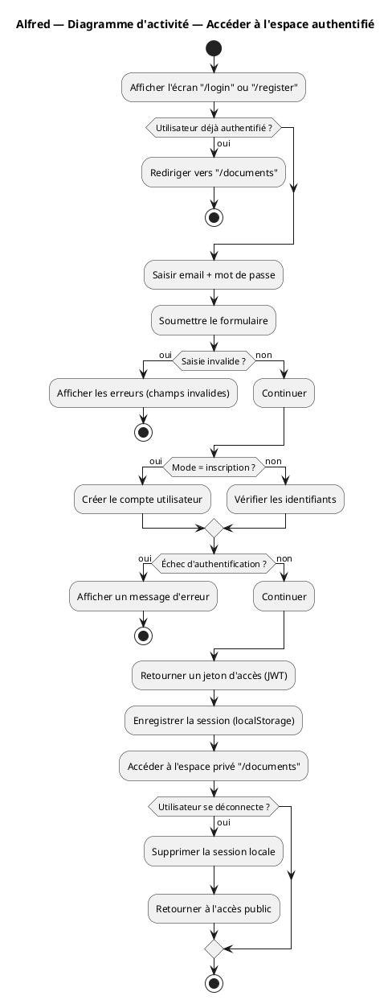
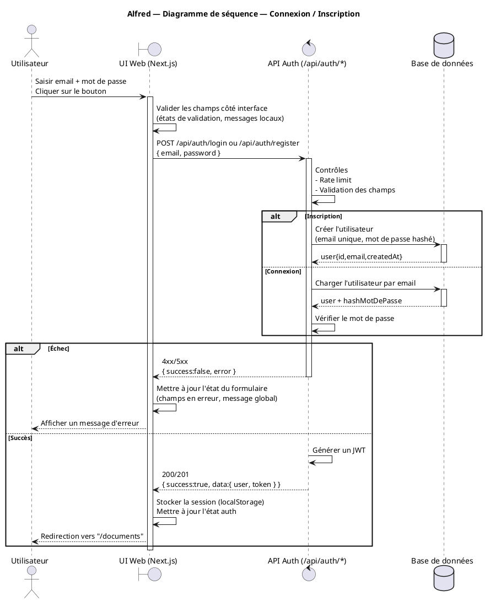
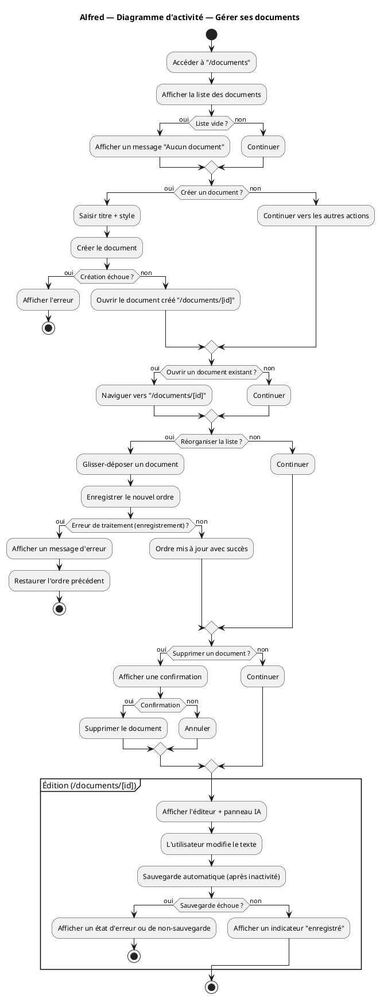
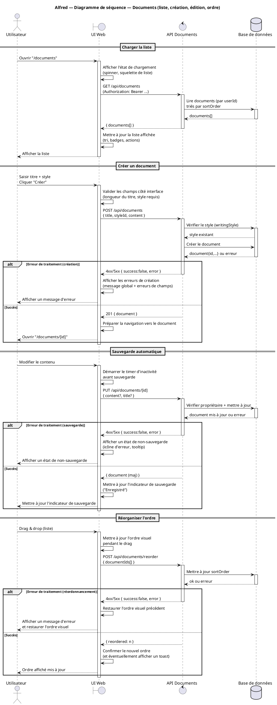
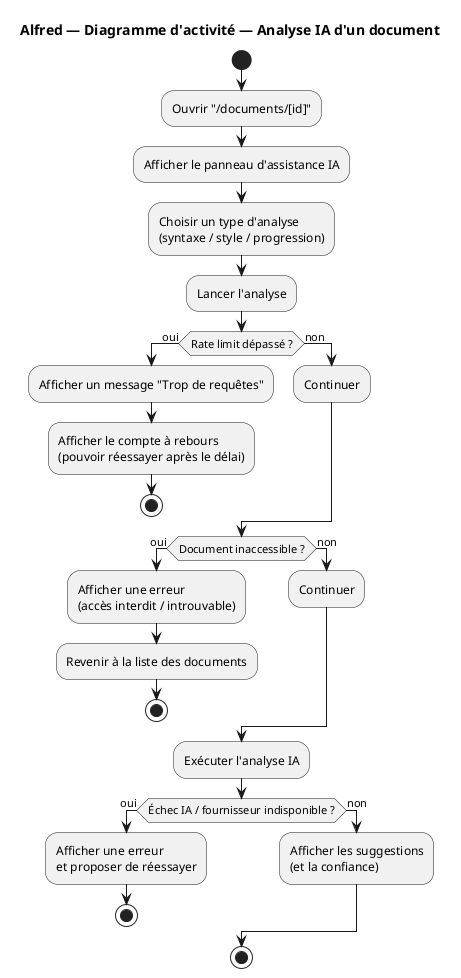
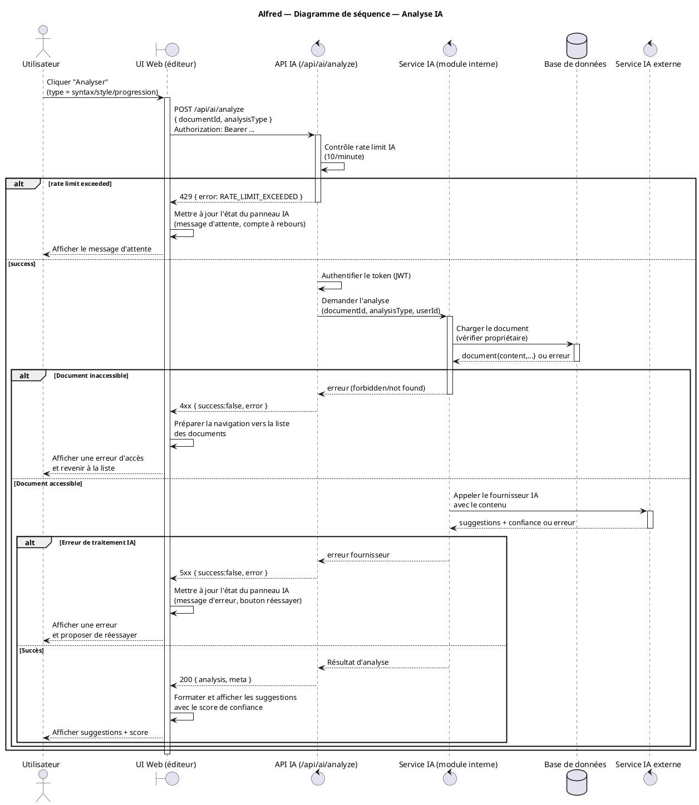
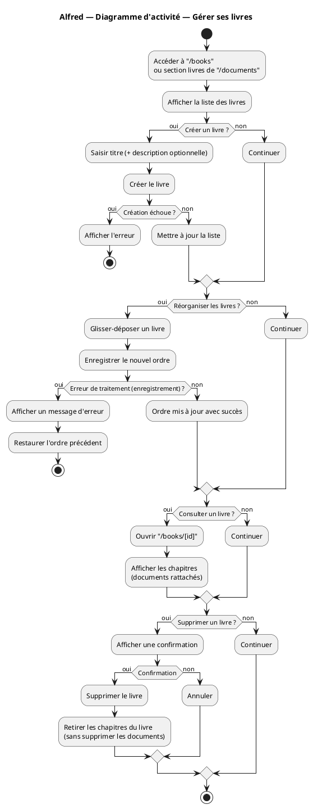
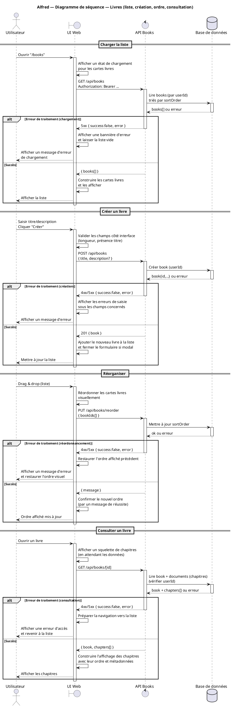
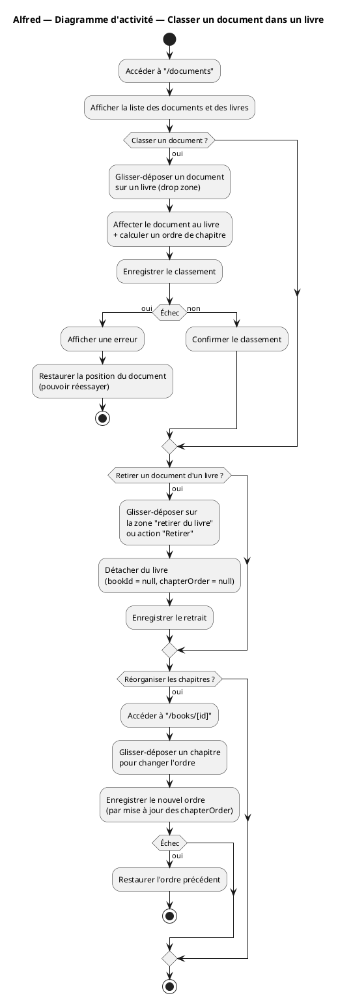
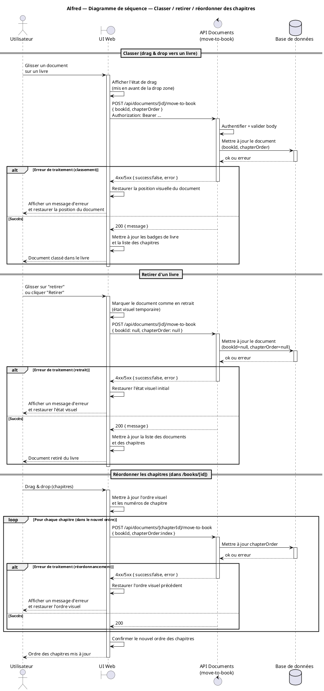

# 5.7. Fonctionnalités détaillées les plus significatives

**Date :** 9 février 2026  
**Application :** Alfred - Assistant d'Écriture avec Intelligence Artificielle

---

Cette section décrit les **5 fonctionnalités les plus significatives** de l'application Alfred du point de vue **utilisateur** (CE QU'ELLE FAIT, pas COMMENT elle le fait). Chaque fonctionnalité est documentée avec :

- **Description** : Ce que la fonctionnalité fait pour l'utilisateur
- **Diagramme d'activité** : Flux de processus et workflow
- **Diagramme de séquence** : Interactions entre les composants
- **Données/Actions** : Tableau détaillé des données d'entrée, traitement, sortie et contrôles
- **Ecran/Affichage** : Règles d'ergonomie, transitions, formatage, contrôles de saisie

---

## 5.7.1. Fonctionnalité 1 : Accéder à l'espace authentifié (Inscription / Connexion / Déconnexion)

### Description

L'utilisateur peut créer un compte ou se connecter pour accéder à son espace privé (documents, livres, analyses IA). Une fois authentifié, il reste connecté jusqu'à ce qu'il se déconnecte explicitement. L'application empêche l'accès aux écrans privés si l'utilisateur n'est pas authentifié. La session est conservée dans le navigateur via un token JWT stocké en localStorage.

**Du point de vue utilisateur :**
- L'utilisateur peut créer un compte avec son email et un mot de passe sécurisé
- L'utilisateur peut se connecter avec ses identifiants pour accéder à ses documents
- L'utilisateur reste connecté entre les sessions (sauf déconnexion explicite)
- L'utilisateur peut se déconnecter à tout moment
- L'application protège contre les tentatives de connexion répétées (rate limiting)

### Diagramme d'activité

**Fichier :** `docs/diagramme-activite-auth.puml`

### Diagramme de séquence

**Fichier :** `docs/diagramme-sequence-auth.puml`

### Données/Actions

#### Données en entrée

**1. Email** (`email`)
- **Traitement** : Validation du format email, vérification de l'unicité (inscription), recherche utilisateur (connexion)
- **En sortie** : Utilisateur authentifié (`user`) avec `id`, `email`, `createdAt`
- **Contrôles** : Format email valide (RFC 5322), email unique en base (inscription uniquement)

**2. Mot de passe** (`password`)
- **Traitement** : Hashage bcrypt (inscription), comparaison sécurisée avec hash stocké (connexion)
- **En sortie** : Jeton JWT (`token`) pour authentification
- **Contrôles** : Longueur minimale : 8 caractères (inscription), mot de passe requis (connexion)

**3. Action demandée** (`/login` ou `/register`)
- **Traitement** : Application du rate limiting pour limiter brute force/spam
- **En sortie** : Redirection vers `/documents`
- **Contrôles** : Rate limit : 5 requêtes par 15 minutes par IP

**4. Token JWT** (si déjà authentifié)
- **Traitement** : Vérification de validité et expiration
- **En sortie** : Accès autorisé ou redirection
- **Contrôles** : Token valide, non expiré, signature correcte

#### Dictionnaire de données détaillé

**Email** (`email`)
- **Type** : Texte
- **Longueur** : 254 caractères maximum
- **Sémantique** : Identifiant unique de connexion
- **Valeurs de référence** : Format email standard (RFC 5322)
- **Limites** : Doit respecter le format email valide

**Mot de passe** (`password`, abr. `pwd`)
- **Type** : Texte
- **Longueur** : 8 à 128 caractères
- **Sémantique** : Secret utilisateur (hashé en base avec bcrypt)
- **Valeurs de référence** : -
- **Limites** : Minimum 8 caractères, recommandé : majuscule, minuscule, chiffre

**Jeton JWT** (`token`, abr. `jwt`)
- **Type** : Texte
- **Longueur** : Variable (~200-500 caractères)
- **Sémantique** : Preuve d'authentification
- **Valeurs de référence** : Format JWT standard
- **Limites** : Valide pendant 7 jours, envoyé via header `Authorization: Bearer <token>`

**Identifiant utilisateur** (`userId`, abr. `id`)
- **Type** : Texte (CUID)
- **Longueur** : Variable (~25 caractères)
- **Sémantique** : Identifiant unique utilisateur
- **Valeurs de référence** : Format CUID (Collision-resistant Unique Identifier)
- **Limites** : Généré automatiquement, unique en base

**Date de création** (`createdAt`)
- **Type** : DateTime
- **Format** : ISO 8601
- **Sémantique** : Date de création du compte
- **Valeurs de référence** : Format ISO 8601
- **Limites** : Générée automatiquement à la création

### Ecran/Affichage

#### Écrans concernés

- **Page de connexion** (`/login`) : Formulaire avec champs email et mot de passe
- **Page d'inscription** (`/register`) : Formulaire avec champs email, mot de passe et confirmation
- **Zone privée** : Toutes les pages nécessitant authentification (`/documents`, `/books`, `/documents/[id]`, `/books/[id]`)

#### Règles d'affichage

**1. Validation visuelle des champs :**
- Les champs email et mot de passe affichent des messages d'erreur en cas de saisie invalide
- Validation en temps réel (côté client) avec feedback immédiat
- Messages d'erreur spécifiques :
  - Email : "Format d'email invalide"
  - Mot de passe (inscription) : "Le mot de passe doit contenir au moins 8 caractères"
  - Mot de passe (connexion) : "Le mot de passe est requis"

**2. États du bouton de soumission :**
- **État normal** : Bouton "Se connecter" ou "Créer un compte" activé
- **État chargement** : Bouton désactivé avec indicateur de chargement (spinner) pendant l'envoi
- **État erreur** : Message d'erreur affiché sous le formulaire

**3. Gestion des erreurs :**
- **Identifiants invalides** : Message "Email ou mot de passe incorrect"
- **Email déjà utilisé** (inscription) : Message "Cet email est déjà utilisé"
- **Rate limit dépassé** : Message "Trop de tentatives. Veuillez réessayer dans quelques minutes"
- **Erreur serveur** : Message générique "Une erreur est survenue. Veuillez réessayer"

**4. Redirection automatique :**
- Si l'utilisateur est déjà authentifié et accède à `/login` ou `/register`, redirection automatique vers `/documents`
- Après connexion/inscription réussie, redirection automatique vers `/documents`

**5. Liens de navigation :**
- Lien "Créer un compte" sur la page de connexion → `/register`
- Lien "Se connecter" sur la page d'inscription → `/login`

**6. Formatage des données :**
- Email : Conversion automatique en minuscules avant validation
- Mot de passe : Masqué par défaut (type="password"), possibilité d'afficher/masquer via icône

**7. Contrôles de saisie :**
- **Email** : Validation du format en temps réel, accepte les caractères standards (lettres, chiffres, @, ., -, _)
- **Mot de passe** : Masqué par défaut, indicateur de force du mot de passe (optionnel, pour inscription)

---

## 5.7.2. Fonctionnalité 2 : Gérer ses documents (Liste, Création, Édition, Suppression, Réorganisation)

### Description

L'utilisateur peut consulter la liste de ses documents, créer un nouveau document, ouvrir un document pour l'éditer, supprimer un document et réorganiser l'ordre d'affichage par glisser-déposer. Depuis la page d'édition, l'utilisateur peut modifier le titre et le contenu ; la sauvegarde est effectuée automatiquement après une période d'inactivité pour éviter la perte de travail. Chaque document peut être associé à un style d'écriture (Roman, Nouvelle, Poésie, etc.) et peut être classé dans un livre comme chapitre.

**Du point de vue utilisateur :**
- L'utilisateur voit tous ses documents sur une seule page, triés par ordre personnalisé
- L'utilisateur peut créer un nouveau document en saisissant un titre et en choisissant un style
- L'utilisateur peut ouvrir un document pour le modifier
- L'utilisateur peut réorganiser ses documents par glisser-déposer
- L'utilisateur peut supprimer un document (avec confirmation)
- Les modifications sont sauvegardées automatiquement sans action de l'utilisateur

### Diagramme d'activité

**Fichier :** `docs/diagramme-activite-documents.puml`

### Diagramme de séquence

**Fichier :** `docs/diagramme-sequence-documents.puml`

### Données/Actions

#### Données en entrée

**1. Titre du document** (`title`)
- **Traitement** : Validation de la longueur, nettoyage des espaces
- **En sortie** : Document créé avec `id`, `title`, `content`, `wordCount`, `style`, `version`, `sortOrder`, `createdAt`, `updatedAt`
- **Contrôles** : Longueur : 1 à 200 caractères, titre requis, non vide

**2. Contenu du document** (`content`)
- **Traitement** : Calcul du nombre de mots, création du DocumentContent (Value Object)
- **En sortie** : Nombre de mots calculé (`wordCount`)
- **Contrôles** : Contenu requis (minimum 1 caractère), pas de limite maximale

**3. Style d'écriture** (`styleId`)
- **Traitement** : Vérification de l'existence du style en base, création de l'entité WritingStyle
- **En sortie** : Style associé avec `id`, `name`, `description`
- **Contrôles** : StyleId doit exister en base, référence à la table `writing_styles`

**4. Ordre de tri** (`sortOrder`)
- **Traitement** : Génération automatique (timestamp) à la création, mise à jour lors du réordonnement
- **En sortie** : Ordre de tri mis à jour pour tous les documents réordonnés
- **Contrôles** : Ordre unique par utilisateur, mis à jour par drag & drop

**5. Identifiant utilisateur** (`userId`)
- **Traitement** : Récupéré depuis le token JWT, vérification de propriété pour les modifications
- **En sortie** : Liste filtrée par utilisateur
- **Contrôles** : Vérification de propriété obligatoire pour toutes les opérations

#### Dictionnaire de données détaillé

**Titre du document** (`title`)
- **Type** : Texte
- **Longueur** : 1 à 200 caractères
- **Sémantique** : Nom du document
- **Valeurs de référence** : -
- **Limites** : Minimum 1 caractère, maximum 200 caractères

**Contenu du document** (`content`)
- **Type** : Texte
- **Longueur** : Illimité
- **Sémantique** : Texte écrit par l'utilisateur
- **Valeurs de référence** : -
- **Limites** : Minimum 1 caractère, pas de limite maximale

**Nombre de mots** (`wordCount`)
- **Type** : Entier
- **Plage** : 0 à 2^31-1
- **Sémantique** : Nombre de mots dans le contenu
- **Valeurs de référence** : Calculé automatiquement
- **Limites** : Généré automatiquement à partir du contenu

**Identifiant du style** (`styleId`)
- **Type** : Texte (CUID)
- **Longueur** : Variable (~25 caractères)
- **Sémantique** : Référence au style d'écriture
- **Valeurs de référence** : Liste des styles disponibles (Roman, Nouvelle, Poésie, etc.)
- **Limites** : Doit exister dans la table `writing_styles`

**Version du document** (`version`, abr. `v`)
- **Type** : Entier
- **Plage** : 1 à 2^31-1
- **Sémantique** : Numéro de version actuelle
- **Valeurs de référence** : Incrémenté à chaque modification majeure
- **Limites** : Commence à 1, incrémenté automatiquement

**Ordre de tri** (`sortOrder`)
- **Type** : Entier
- **Plage** : 0 à 2^31-1
- **Sémantique** : Position dans la liste
- **Valeurs de référence** : Généré automatiquement (timestamp)
- **Limites** : Unique par utilisateur, mis à jour par drag & drop

**Identifiant du document** (`documentId`, abr. `id`)
- **Type** : Texte (CUID)
- **Longueur** : Variable (~25 caractères)
- **Sémantique** : Identifiant unique du document
- **Valeurs de référence** : Format CUID
- **Limites** : Généré automatiquement, unique en base

**Date de création** (`createdAt`)
- **Type** : DateTime
- **Format** : ISO 8601
- **Sémantique** : Date de création
- **Valeurs de référence** : Format ISO 8601
- **Limites** : Générée automatiquement

**Date de modification** (`updatedAt`)
- **Type** : DateTime
- **Format** : ISO 8601
- **Sémantique** : Date de dernière modification
- **Valeurs de référence** : Format ISO 8601
- **Limites** : Mise à jour automatiquement à chaque modification

### Ecran/Affichage

#### Écrans concernés

- **Page liste des documents** (`/documents`) : Liste des documents sous forme de cartes
- **Page édition de document** (`/documents/[id]`) : Éditeur de texte avec panneau IA

#### Règles d'affichage

**1. Page liste des documents (`/documents`) :**

**Affichage de la liste :**
- **Format Desktop** : Grille de 3 colonnes avec cartes de documents
- **Format Tablette** : Grille de 2 colonnes
- **Format Mobile** : Liste verticale empilée
- Chaque carte affiche :
  - Titre du document (en gras, tronqué si trop long)
  - Style d'écriture (badge coloré)
  - Nombre de mots
  - Date de dernière modification (format relatif : "Il y a 2 heures")
  - Bouton "Ouvrir" ou clic sur la carte pour accéder à l'édition

**Bouton "Créer un document" :**
- Bouton principal en haut de la liste
- Ouvre un formulaire modal ou inline pour saisir :
  - Champ titre (obligatoire, max 200 caractères)
  - Sélecteur de style d'écriture (dropdown avec tous les styles disponibles)
  - Bouton "Créer" qui crée le document et redirige vers l'éditeur

**Réorganisation par glisser-déposer :**
- Les cartes sont draggables (icône de poignée visible au survol)
- Zone de drop visible pendant le drag
- Animation fluide lors du repositionnement
- Indicateur visuel de l'ordre en cours de modification
- Sauvegarde automatique après le drop

**Message "Aucun document" :**
- Affiché si la liste est vide
- Message : "Vous n'avez pas encore de document. Créez-en un pour commencer !"
- Bouton "Créer mon premier document" centré

**2. Page édition de document (`/documents/[id]`) :**

**Zone d'édition :**
- **Format Desktop** : Zone d'édition à gauche (60% de la largeur)
- **Format Mobile** : Zone d'édition plein écran
- Champ titre : En haut, modifiable directement
- Éditeur de texte : Zone de texte multiligne avec :
  - Sauvegarde automatique après 2 secondes d'inactivité
  - Indicateur de sauvegarde : "Enregistré" (vert) / "Enregistrement..." (orange) / "Erreur" (rouge)
  - Compteur de mots en temps réel (affiché en bas à droite)

**Indicateur de sauvegarde :**
- **État "Enregistré"** : Icône ✓ verte + texte "Enregistré" (affiché 2 secondes après sauvegarde réussie)
- **État "Enregistrement..."** : Icône ⏳ orange + texte "Enregistrement..." (pendant la requête)
- **État "Erreur"** : Icône ✗ rouge + texte "Erreur de sauvegarde" (en cas d'échec)

**Bouton retour :**
- Bouton "← Retour" en haut à gauche
- Redirige vers `/documents`

**3. Contrôles de saisie :**

**Titre :**
- Validation en temps réel : affichage du nombre de caractères restants (ex: "150/200")
- Message d'erreur si vide : "Le titre est requis"
- Message d'erreur si trop long : "Le titre ne doit pas dépasser 200 caractères"

**Contenu :**
- Pas de limite de longueur affichée
- Compteur de mots mis à jour en temps réel
- Sauvegarde automatique déclenchée après 2 secondes d'inactivité

**4. Transitions entre écrans :**

- **Création → Édition** : Redirection automatique vers `/documents/[id]` après création réussie
- **Liste → Édition** : Navigation via clic sur la carte ou bouton "Ouvrir"
- **Édition → Liste** : Navigation via bouton "Retour"

**5. Formatage des données :**

- **Date de modification** : Format relatif ("Il y a 2 heures", "Il y a 3 jours")
- **Nombre de mots** : Format avec séparateur de milliers (ex: "1 234 mots")
- **Titre** : Tronqué avec "..." si dépasse la largeur de la carte

---

## 5.7.3. Fonctionnalité 3 : Analyser un document avec l'Intelligence Artificielle

### Description

L'utilisateur peut demander une analyse de son document par l'intelligence artificielle pour obtenir des suggestions d'amélioration. Trois types d'analyses sont disponibles : analyse syntaxique (correction grammaticale et orthographique), analyse de style (cohérence, fluidité, ton), et analyse de progression narrative (structure, rythme, développement). L'utilisateur choisit le type d'analyse souhaité, lance l'analyse, et reçoit des suggestions avec un niveau de confiance. Les analyses sont limitées en fréquence pour éviter l'abus (rate limiting).

**Du point de vue utilisateur :**
- L'utilisateur peut choisir parmi 3 types d'analyses (syntaxe, style, progression)
- L'utilisateur lance l'analyse en un clic depuis le panneau IA
- L'utilisateur reçoit des suggestions détaillées avec un score de confiance
- L'utilisateur peut relancer une analyse à tout moment
- L'application limite le nombre d'analyses pour éviter la surcharge

### Diagramme d'activité

**Fichier :** `docs/diagramme-activite-analyse-ia.puml`

### Diagramme de séquence

**Fichier :** `docs/diagramme-sequence-analyse-ia.puml`

### Données/Actions

#### Données en entrée

**1. Identifiant du document** (`documentId`)
- **Traitement** : Vérification de l'existence et de la propriété, chargement du contenu
- **En sortie** : Analyse complète avec suggestions
- **Contrôles** : Document doit exister et appartenir à l'utilisateur

**2. Type d'analyse** (`analysisType`)
- **Traitement** : Validation du type, préparation du prompt spécifique
- **En sortie** : Suggestions formatées selon le type
- **Contrôles** : Valeurs autorisées : "syntax", "style", "progression"

**3. Contenu du document** (`content`)
- **Traitement** : Extraction du texte, préparation pour l'API IA
- **En sortie** : Suggestions d'amélioration
- **Contrôles** : Contenu non vide, longueur maximale selon le fournisseur IA

**4. Identifiant utilisateur** (`userId`)
- **Traitement** : Vérification de propriété, comptage des analyses récentes
- **En sortie** : Analyse sauvegardée en base avec `id`, `documentId`, `type`, `suggestions`, `confidence`, `createdAt`
- **Contrôles** : Rate limit : 10 analyses par minute par utilisateur

#### Dictionnaire de données détaillé

**Type d'analyse** (`analysisType`, abr. `type`)
- **Type** : Texte
- **Sémantique** : Type d'analyse demandé
- **Valeurs de référence** : "syntax" (analyse syntaxique), "style" (analyse de style), "progression" (analyse narrative)
- **Limites** : Doit être l'une des 3 valeurs autorisées

**Suggestions** (`suggestions`)
- **Type** : Tableau JSON
- **Sémantique** : Liste des suggestions d'amélioration
- **Valeurs de référence** : Tableau de chaînes de caractères
- **Limites** : Format JSON, chaque suggestion est une chaîne de caractères

**Niveau de confiance** (`confidence`)
- **Type** : Réel
- **Plage** : 0.0 à 1.0
- **Sémantique** : Score de confiance de l'analyse
- **Valeurs de référence** : Valeur décimale entre 0.0 et 1.0
- **Limites** : 0.0 = faible confiance, 1.0 = très haute confiance

**Identifiant de l'analyse** (`analysisId`, abr. `id`)
- **Type** : Texte (CUID)
- **Longueur** : Variable (~25 caractères)
- **Sémantique** : Identifiant unique de l'analyse
- **Valeurs de référence** : Format CUID
- **Limites** : Généré automatiquement, unique en base

**Métadonnées** (`metadata`, abr. `meta`)
- **Type** : Objet JSON
- **Sémantique** : Informations complémentaires
- **Valeurs de référence** : Objet JSON optionnel
- **Limites** : Peut contenir des informations sur le modèle utilisé, la durée, etc.

**Date de création** (`createdAt`)
- **Type** : DateTime
- **Format** : ISO 8601
- **Sémantique** : Date de création de l'analyse
- **Valeurs de référence** : Format ISO 8601
- **Limites** : Générée automatiquement

### Ecran/Affichage

#### Écrans concernés

- **Page édition de document** (`/documents/[id]`) : Panneau d'analyse IA à droite (desktop) ou en bas (mobile)

#### Règles d'affichage

**1. Panneau d'analyse IA :**

**Format Desktop :**
- Panneau fixe à droite de l'écran (40% de la largeur)
- Séparé de la zone d'édition par une bordure verticale
- Scrollable si le contenu dépasse la hauteur

**Format Mobile :**
- Panneau accessible via un bouton "Analyser" qui ouvre une modal plein écran
- Modal avec bouton de fermeture en haut à droite

**2. Sélection du type d'analyse :**

- **3 boutons/onglets** : "Analyse syntaxique", "Analyse de style", "Analyse narrative"
- Bouton actif mis en évidence (couleur différente, bordure)
- Description courte sous chaque type :
  - Syntaxe : "Correction grammaticale et orthographique"
  - Style : "Cohérence, fluidité et ton"
  - Progression : "Structure, rythme et développement"

**3. Bouton "Lancer l'analyse" :**

- Bouton principal en bas du panneau
- **État normal** : "Analyser" (bleu)
- **État chargement** : "Analyse en cours..." avec spinner (désactivé)
- **État erreur** : Message d'erreur affiché au-dessus du bouton

**4. Affichage des résultats :**

**Structure des résultats :**
- **En-tête** : Type d'analyse + score de confiance (ex: "Analyse syntaxique - Confiance : 85%")
- **Barre de progression** : Visualisation du score de confiance (barre colorée)
- **Liste des suggestions** :
  - Chaque suggestion dans une carte séparée
  - Numérotation (1, 2, 3...)
  - Texte de la suggestion en gras
  - Contexte optionnel (extrait du document concerné)
  - Bouton "Appliquer" pour chaque suggestion (optionnel)

**Formatage du score de confiance :**
- **≥ 80%** : Vert (haute confiance)
- **50-79%** : Orange (confiance moyenne)
- **< 50%** : Rouge (faible confiance)

**5. Gestion des erreurs :**

**Rate limit dépassé :**
- Message : "Trop de requêtes. Veuillez attendre quelques instants avant de relancer une analyse."
- Compte à rebours affiché : "Réessayer dans 45 secondes"
- Bouton "Lancer l'analyse" désactivé pendant le délai

**Erreur serveur / fournisseur IA indisponible :**
- Message : "L'analyse n'a pas pu être effectuée. Veuillez réessayer."
- Bouton "Réessayer" affiché

**Document vide :**
- Message : "Le document est vide. Ajoutez du contenu pour lancer une analyse."
- Bouton "Lancer l'analyse" désactivé

**6. Transitions et animations :**

- **Chargement** : Animation de spinner pendant l'analyse (2-5 secondes typiquement)
- **Affichage des résultats** : Animation de fade-in pour les suggestions
- **Changement de type** : Transition fluide entre les types d'analyse

**7. Contrôles de saisie :**

- Aucune saisie utilisateur requise (sélection du type uniquement)
- Validation automatique : vérification que le document n'est pas vide avant d'autoriser l'analyse

---

## 5.7.4. Fonctionnalité 4 : Gérer ses livres (Création, Consultation, Suppression, Réorganisation)

### Description

L'utilisateur peut créer des livres pour organiser ses documents en chapitres. Un livre est un conteneur qui regroupe plusieurs documents (chapitres) dans un ordre spécifique. L'utilisateur peut consulter un livre pour voir tous ses chapitres, créer de nouveaux livres, supprimer un livre (les documents ne sont pas supprimés, seulement retirés du livre), et réorganiser l'ordre des livres par glisser-déposer. Les livres permettent d'organiser un projet d'écriture plus long (roman, recueil, etc.).

**Du point de vue utilisateur :**
- L'utilisateur peut créer un livre avec un titre et une description optionnelle
- L'utilisateur voit tous ses livres sur une page dédiée
- L'utilisateur peut ouvrir un livre pour voir ses chapitres
- L'utilisateur peut réorganiser ses livres par glisser-déposer
- L'utilisateur peut supprimer un livre (les documents restent disponibles)

### Diagramme d'activité

**Fichier :** `docs/diagramme-activite-livres.puml`

### Diagramme de séquence

**Fichier :** `docs/diagramme-sequence-livres.puml`

### Données/Actions

#### Données en entrée

**1. Titre du livre** (`title`)
- **Traitement** : Validation de la longueur, nettoyage des espaces
- **En sortie** : Livre créé avec `id`, `title`, `description`, `sortOrder`, `createdAt`, `updatedAt`
- **Contrôles** : Longueur : 1 à 200 caractères, titre requis, non vide

**2. Description du livre** (`description`)
- **Traitement** : Stockage optionnel, validation de la longueur
- **En sortie** : Description associée au livre
- **Contrôles** : Optionnel, longueur maximale : 1000 caractères

**3. Ordre de tri** (`sortOrder`)
- **Traitement** : Génération automatique (timestamp) à la création, mise à jour lors du réordonnement
- **En sortie** : Ordre de tri mis à jour pour tous les livres réordonnés
- **Contrôles** : Ordre unique par utilisateur, mis à jour par drag & drop

**4. Identifiant utilisateur** (`userId`)
- **Traitement** : Récupéré depuis le token JWT, vérification de propriété
- **En sortie** : Liste filtrée par utilisateur
- **Contrôles** : Vérification de propriété obligatoire pour toutes les opérations

**5. Liste des identifiants de livres** (`bookIds[]`)
- **Traitement** : Mise à jour de l'ordre de tri pour chaque livre
- **En sortie** : Confirmation de réordonnement
- **Contrôles** : Tableau non vide, tous les IDs doivent appartenir à l'utilisateur

#### Dictionnaire de données détaillé

**Titre du livre** (`title`)
- **Type** : Texte
- **Longueur** : 1 à 200 caractères
- **Sémantique** : Nom du livre
- **Valeurs de référence** : -
- **Limites** : Minimum 1 caractère, maximum 200 caractères

**Description du livre** (`description`, abr. `desc`)
- **Type** : Texte
- **Longueur** : 0 à 1000 caractères
- **Sémantique** : Description optionnelle du livre
- **Valeurs de référence** : -
- **Limites** : Optionnel, maximum 1000 caractères

**Ordre de tri** (`sortOrder`)
- **Type** : Entier
- **Plage** : 0 à 2^31-1
- **Sémantique** : Position dans la liste
- **Valeurs de référence** : Généré automatiquement (timestamp)
- **Limites** : Unique par utilisateur, mis à jour par drag & drop

**Identifiant du livre** (`bookId`, abr. `id`)
- **Type** : Texte (CUID)
- **Longueur** : Variable (~25 caractères)
- **Sémantique** : Identifiant unique du livre
- **Valeurs de référence** : Format CUID
- **Limites** : Généré automatiquement, unique en base

**Date de création** (`createdAt`)
- **Type** : DateTime
- **Format** : ISO 8601
- **Sémantique** : Date de création
- **Valeurs de référence** : Format ISO 8601
- **Limites** : Générée automatiquement

**Date de modification** (`updatedAt`)
- **Type** : DateTime
- **Format** : ISO 8601
- **Sémantique** : Date de dernière modification
- **Valeurs de référence** : Format ISO 8601
- **Limites** : Mise à jour automatiquement à chaque modification

**Nombre de chapitres** (`chapterCount`)
- **Type** : Entier
- **Plage** : 0 à 2^31-1
- **Sémantique** : Nombre de documents dans le livre
- **Valeurs de référence** : Calculé à partir des documents associés
- **Limites** : Affiché mais non stocké directement

### Ecran/Affichage

#### Écrans concernés

- **Page liste des livres** (`/books`) : Liste des livres sous forme de cartes
- **Page consultation d'un livre** (`/books/[id]`) : Affichage des chapitres d'un livre

#### Règles d'affichage

**1. Page liste des livres (`/books`) :**

**Affichage de la liste :**
- **Format Desktop** : Grille de 3 colonnes avec cartes de livres
- **Format Tablette** : Grille de 2 colonnes
- **Format Mobile** : Liste verticale empilée
- Chaque carte affiche :
  - Titre du livre (en gras)
  - Description (tronquée si trop longue, avec "..." et tooltip au survol)
  - Nombre de chapitres (badge : "5 chapitres")
  - Date de création (format relatif : "Créé il y a 3 jours")
  - Bouton "Ouvrir" ou clic sur la carte pour consulter le livre

**Bouton "Créer un livre" :**
- Bouton principal en haut de la liste
- Ouvre un formulaire modal pour saisir :
  - Champ titre (obligatoire, max 200 caractères)
  - Champ description (optionnel, textarea, max 1000 caractères)
  - Bouton "Créer" qui crée le livre et met à jour la liste

**Réorganisation par glisser-déposer :**
- Les cartes sont draggables (icône de poignée visible au survol)
- Zone de drop visible pendant le drag
- Animation fluide lors du repositionnement
- Sauvegarde automatique après le drop

**Message "Aucun livre" :**
- Affiché si la liste est vide
- Message : "Vous n'avez pas encore de livre. Créez-en un pour organiser vos documents !"
- Bouton "Créer mon premier livre" centré

**2. Page consultation d'un livre (`/books/[id]`) :**

**En-tête du livre :**
- Titre du livre (grand, en gras)
- Description (si présente, sous le titre)
- Bouton "Retour" en haut à gauche

**Liste des chapitres :**
- Affichage vertical des chapitres (documents) dans l'ordre défini
- Chaque chapitre affiche :
  - Numéro de chapitre (badge : "Chapitre 1", "Chapitre 2"...)
  - Titre du document (lien cliquable vers `/documents/[id]`)
  - Nombre de mots
  - Date de dernière modification
  - Bouton "Retirer du livre" (optionnel)

**Réorganisation des chapitres :**
- Glisser-déposer pour réorganiser l'ordre des chapitres
- Sauvegarde automatique de l'ordre après le drop
- Numérotation mise à jour automatiquement

**Message "Aucun chapitre" :**
- Affiché si le livre est vide
- Message : "Ce livre est vide. Ajoutez des documents depuis la page de liste des documents."

**3. Contrôles de saisie :**

**Titre :**
- Validation en temps réel : affichage du nombre de caractères restants (ex: "150/200")
- Message d'erreur si vide : "Le titre est requis"
- Message d'erreur si trop long : "Le titre ne doit pas dépasser 200 caractères"

**Description :**
- Optionnel (peut être laissé vide)
- Compteur de caractères : "X/1000"
- Message d'erreur si trop long : "La description ne doit pas dépasser 1000 caractères"

**4. Transitions entre écrans :**

- **Création → Liste** : Mise à jour de la liste après création réussie
- **Liste → Consultation** : Navigation via clic sur la carte ou bouton "Ouvrir"
- **Consultation → Liste** : Navigation via bouton "Retour"
- **Consultation → Document** : Navigation via clic sur le titre d'un chapitre vers `/documents/[id]`

**5. Formatage des données :**

- **Date de création** : Format relatif ("Créé il y a 3 jours")
- **Nombre de chapitres** : Format simple ("5 chapitres", "1 chapitre", "Aucun chapitre")
- **Description** : Tronquée avec "..." si dépasse 100 caractères dans la liste, complète dans la consultation

---

## 5.7.5. Fonctionnalité 5 : Classer un document dans un livre (Assignation / Retrait / Réorganisation des chapitres)

### Description

L'utilisateur peut classer un document dans un livre pour en faire un chapitre. Cette fonctionnalité permet d'organiser plusieurs documents dans un ordre spécifique pour créer un projet d'écriture plus long (roman, recueil, etc.). L'utilisateur peut assigner un document à un livre par glisser-déposer, retirer un document d'un livre, et réorganiser l'ordre des chapitres dans un livre. Lorsqu'un document est retiré d'un livre, il reste disponible dans la liste générale des documents.

**Du point de vue utilisateur :**
- L'utilisateur peut glisser un document sur un livre pour l'y ajouter comme chapitre
- L'utilisateur peut retirer un document d'un livre (le document reste disponible)
- L'utilisateur peut réorganiser l'ordre des chapitres dans un livre
- L'utilisateur voit visuellement quels documents sont dans quels livres

### Diagramme d'activité

**Fichier :** `docs/diagramme-activite-classement-document-livre.puml`

### Diagramme de séquence

**Fichier :** `docs/diagramme-sequence-classement-document-livre.puml`

### Données/Actions

#### Données en entrée

**1. Identifiant du document** (`documentId`)
- **Traitement** : Vérification de l'existence et de la propriété
- **En sortie** : Document mis à jour avec `bookId` et `chapterOrder`
- **Contrôles** : Document doit exister et appartenir à l'utilisateur

**2. Identifiant du livre** (`bookId`)
- **Traitement** : Vérification de l'existence et de la propriété, calcul de l'ordre du chapitre
- **En sortie** : Document assigné au livre avec ordre de chapitre
- **Contrôles** : Livre doit exister et appartenir à l'utilisateur, peut être `null` pour retirer

**3. Ordre du chapitre** (`chapterOrder`)
- **Traitement** : Calcul automatique (dernier chapitre + 1) ou spécifié lors du réordonnement
- **En sortie** : Ordre de chapitre mis à jour
- **Contrôles** : Entier positif, calculé automatiquement si non spécifié

**4. Action** (assigner/retirer)
- **Traitement** : Mise à jour de `bookId` et `chapterOrder` dans le document
- **En sortie** : Confirmation de l'opération
- **Contrôles** : `bookId` = `null` pour retirer, `bookId` = ID du livre pour assigner

#### Dictionnaire de données détaillé

**Identifiant du livre** (`bookId`)
- **Type** : Texte (CUID) ou NULL
- **Longueur** : Variable (~25 caractères)
- **Sémantique** : Référence au livre parent
- **Valeurs de référence** : Format CUID ou `null`
- **Limites** : Doit exister dans la table `books` ou être `null` pour retirer

**Ordre du chapitre** (`chapterOrder`)
- **Type** : Entier ou NULL
- **Plage** : 1 à 2^31-1
- **Sémantique** : Position du document dans le livre
- **Valeurs de référence** : Entier positif
- **Limites** : Calculé automatiquement (dernier + 1) ou spécifié lors du réordonnement, `null` si document non assigné

**Identifiant du document** (`documentId`, abr. `id`)
- **Type** : Texte (CUID)
- **Longueur** : Variable (~25 caractères)
- **Sémantique** : Identifiant unique du document
- **Valeurs de référence** : Format CUID
- **Limites** : Doit exister et appartenir à l'utilisateur

**Liste des identifiants de chapitres** (`chapterIds[]`)
- **Type** : Tableau de texte
- **Sémantique** : Liste des IDs des chapitres dans le nouvel ordre
- **Valeurs de référence** : Tableau de CUID
- **Limites** : Utilisé pour le réordonnement, tous les IDs doivent appartenir au même livre

### Ecran/Affichage

#### Écrans concernés

- **Page liste des documents** (`/documents`) : Zone de drop pour assigner des documents aux livres
- **Page consultation d'un livre** (`/books/[id]`) : Réorganisation des chapitres

#### Règles d'affichage

**1. Page liste des documents (`/documents`) :**

**Affichage des livres :**
- Les livres sont affichés comme des zones de drop (drop zones) distinctes des documents
- Chaque livre affiche :
  - Titre du livre (en gras)
  - Nombre de chapitres actuels
  - Zone de drop visible au survol d'un document en cours de drag
  - Bordure colorée pendant le drag pour indiquer la zone de drop valide

**Zone "Retirer du livre" :**
- Zone de drop spéciale affichée en haut de la liste
- Visible uniquement pour les documents déjà assignés à un livre
- Libellé : "Retirer du livre" ou icône de retrait
- Bordure rouge pendant le drag pour indiquer l'action de retrait

**Glisser-déposer :**
- **État normal** : Les documents sont draggables (icône de poignée visible au survol)
- **État drag** :
  - Le document en cours de drag devient semi-transparent
  - Les zones de drop valides sont mises en évidence (bordure colorée, fond légèrement coloré)
  - Les zones de drop invalides sont grisées
- **État drop** :
  - Animation de confirmation (checkmark) sur la zone de drop
  - Message de confirmation : "Document ajouté au livre [Titre]" ou "Document retiré du livre"
  - Mise à jour visuelle immédiate de la liste

**Indicateur visuel d'appartenance :**
- Les documents assignés à un livre affichent :
  - Badge avec le titre du livre (ex: "Dans : Mon Roman")
  - Icône de livre à côté du titre
  - Couleur de bordure correspondant au livre (optionnel)

**2. Page consultation d'un livre (`/books/[id]`) :**

**Réorganisation des chapitres :**
- Les chapitres sont draggables (icône de poignée visible au survol)
- Zone de drop visible entre les chapitres pendant le drag
- Ligne de séparation visible pour indiquer la position d'insertion
- Animation de repositionnement fluide après le drop

**Numérotation des chapitres :**
- Numérotation automatique : "Chapitre 1", "Chapitre 2", etc.
- Mise à jour automatique après réorganisation
- Affichée en badge à côté du titre de chaque chapitre

**3. Contrôles de saisie :**

- Aucune saisie utilisateur requise (glisser-déposer uniquement)
- Validation automatique :
  - Vérification que le livre existe et appartient à l'utilisateur
  - Vérification que le document existe et appartient à l'utilisateur
  - Empêche l'assignation d'un document à plusieurs livres simultanément

**4. Transitions et animations :**

- **Drag** : Animation de suivi du curseur avec le document semi-transparent
- **Drop** : Animation de confirmation (checkmark) + message de confirmation temporaire (2 secondes)
- **Réorganisation** : Animation de repositionnement fluide des éléments

**5. Gestion des erreurs :**

**Document déjà dans un autre livre :**
- Message : "Ce document est déjà dans un autre livre. Retirez-le d'abord."
- Drop annulé, document retourne à sa position d'origine

**Livre introuvable :**
- Message : "Le livre n'existe plus."
- Drop annulé

**Erreur serveur :**
- Message : "Une erreur est survenue lors du classement. Veuillez réessayer."
- Document retourne à sa position d'origine

**6. Formatage des données :**

- **Ordre du chapitre** : Affiché comme "Chapitre X" (numérotation automatique)
- **Titre du livre** : Affiché dans le badge d'appartenance (tronqué si trop long)

---

## 6. SPÉCIFICATIONS TECHNIQUES

### 6.1. Référencement

L'application utilise Next.js avec son rendu côté serveur, ce qui améliore l'indexation par les moteurs de recherche. Les URLs sont lisibles et explicites (ex: `/documents`, `/books/[id]`), sans paramètres techniques visibles. Les pages utilisent des balises HTML sémantiques et des métadonnées configurées au niveau du layout. L'objectif est de respecter les bonnes pratiques SEO de base : titres cohérents, descriptions claires, performances correctes grâce au SSR, et compatibilité mobile.

### 6.2. Environnement technique

**Stack technique principale :**

- **Next.js 15.1.3** : Framework React pour le front-end et les API routes côté serveur
- **React 18.3.1** : Bibliothèque pour l'interface utilisateur
- **TypeScript 5.6.3** : Typage statique pour la robustesse du code
- **Tailwind CSS 3.4.14** : Framework CSS pour le design responsive
- **Prisma 5.22.0** : ORM pour la gestion de la base de données
- **SQLite** : Base de données (via Prisma, variable `DATABASE_URL`)

**Authentification et sécurité :**

- **bcryptjs 2.4.3** : Hashage des mots de passe
- **jsonwebtoken 9.0.2** : Gestion des tokens JWT pour l'authentification
- **zod 3.23.8** : Validation des schémas de données

**Services IA :**

- **@anthropic-ai/sdk 0.27.3** : SDK pour l'API Anthropic (Claude)
- **openai 4.73.0** : SDK pour l'API OpenAI

**Architecture et outils de développement :**

- **inversify 6.0.2** : Injection de dépendances (clean architecture)
- **@tanstack/react-query 5.59.20** : Gestion des requêtes et du cache côté client
- **@dnd-kit/core 6.0.8** et **@dnd-kit/sortable 7.0.2** : Drag & drop pour la réorganisation
- **react-hook-form 7.53.2** : Gestion des formulaires
- **date-fns 3.6.0** : Manipulation des dates

**Outils de qualité et tests :**

- **ESLint 8.57.1** : Analyse statique du code
- **Prettier 3.3.3** : Formatage automatique
- **Jest 29.7.0** : Tests unitaires et d'intégration
- **@playwright/test 1.48.2** : Tests end-to-end
- **TypeScript** : Vérification de types

**Gestion de projet :**

- **Git** : Versioning du code
- **GitHub Actions** : CI/CD automatisé (tests, lint, déploiement)
- **Husky 9.1.6** : Git hooks pour la qualité du code

**Justification des choix :**

Next.js a été choisi pour sa capacité à faire du SSR (bon pour le SEO) tout en permettant de créer des API routes dans la même application, ce qui simplifie l'architecture. Prisma offre un typage fort et sécurise les requêtes SQL. SQLite convient au contexte du projet (volume raisonnable, simplicité) mais peut être remplacé par PostgreSQL si besoin. L'architecture propre (clean architecture) avec inversify facilite la maintenabilité et les tests.

### 6.3. Navigation et accessibilité

L'accès se fait via un navigateur web moderne sur une URL unique. Les pages principales sont accessibles directement : accueil, connexion, inscription, documents, livres, pages légales. La navigation interne utilise le routeur de Next.js avec une barre de navigation claire.

L'application est responsive grâce à Tailwind CSS et s'adapte aux différents formats d'écran (desktop, tablette, mobile). Elle vise la compatibilité avec les versions récentes des navigateurs principaux (Chrome, Firefox, Edge, Safari). L'accessibilité est prise en compte : structure sémantique, hiérarchie des titres, contrastes de couleurs, boutons clairement identifiables, messages d'erreur explicites.

### 6.4. Services tiers

Un outil d'analytics (Google Analytics ou équivalent) peut être intégré pour suivre la fréquentation, dans le respect du RGPD (bandeau de consentement, anonymisation). Des métadonnées Open Graph peuvent être ajoutées pour améliorer le partage sur les réseaux sociaux.

Pour les e-mails (confirmation de compte, réinitialisation de mot de passe), l'application peut s'appuyer sur un serveur SMTP ou un service externe (SendGrid, Mailjet, etc.), même si ce n'est pas dans le périmètre minimal actuel. L'intégration d'un CRM n'est pas prévue pour l'instant.

### 6.5. Sécurité

La sécurité repose sur une gestion stricte des droits d'accès : seuls les utilisateurs authentifiés peuvent créer, consulter et modifier leurs propres documents, livres, tags et conversations. Les routes sensibles vérifient systématiquement l'authentification et l'autorisation avant d'exécuter les opérations.

Les mots de passe sont hachés avec bcryptjs avant stockage. Les échanges sont sécurisés via JWT et la gestion de session côté serveur. La validation avec zod et l'utilisation de Prisma réduisent les risques d'injection SQL. Next.js apporte des protections par défaut contre XSS et autres attaques courantes.

Les données sont stockées dans SQLite, avec des sauvegardes gérées par scripts ou infrastructure d'hébergement. Le versioning est assuré par Git, permettant de tracer les changements et de revenir en arrière si besoin. Des mesures complémentaires peuvent être ajoutées : journalisation détaillée, sauvegardes automatisées chiffrées, migration vers une base distante gérée par un cloud provider.

---

## Conclusion

Ces 5 fonctionnalités représentent les fonctionnalités les plus significatives de l'application Alfred. Elles couvrent :

1. **L'authentification** : Accès sécurisé à l'application
2. **La gestion des documents** : Création, édition, organisation des textes
3. **L'analyse IA** : Assistance intelligente pour améliorer l'écriture
4. **La gestion des livres** : Organisation de projets d'écriture plus longs
5. **Le classement** : Organisation flexible des documents en chapitres

Chaque fonctionnalité est documentée avec ses diagrammes, ses données et ses règles d'affichage pour garantir une compréhension complète du système du point de vue utilisateur.

---

**Document généré le :** 9 février 2026  
**Dernière mise à jour :** 9 février 2026  
**Version :** 1.0
