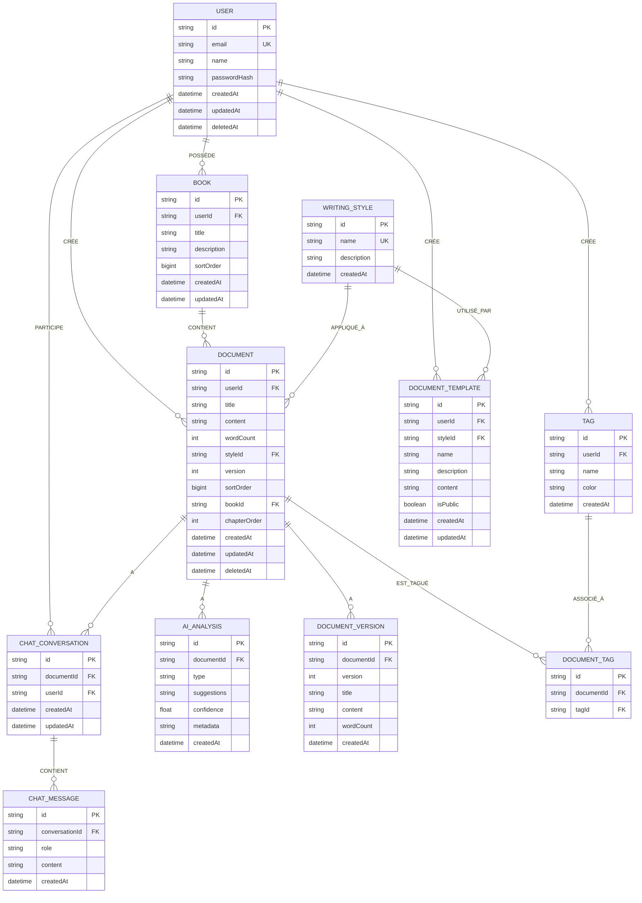

# MCD (Modèle Conceptuel de Données) - MERISE

**Application :** Alfred - Assistant d'écriture IA  
**Date :** 2025-01-13  
**Version :** 2.0 — mise à jour 2026-02-12

---

## Modèle Conceptuel de Données

---

## Légende

- **PK** : Clé primaire (Primary Key)
- **FK** : Clé étrangère (Foreign Key)
- **UK** : Clé unique (Unique Key)
- **Cardinalités** : (1,n) = Un à plusieurs
