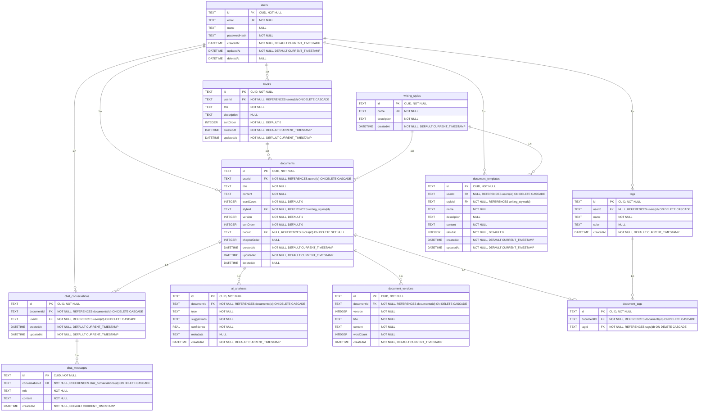

# MLD (Modèle Logique de Données) - MERISE

**Application :** Alfred - Assistant d'écriture IA  
**Date :** 2025-01-13  
**Version :** 2.0 — mise à jour 2026-02-12

---

## Modèle Logique de Données

---

## Contraintes d'intégrité

### Contraintes d'unicité (UNIQUE)

- `users.email` : UNIQUE
- `writing_styles.name` : UNIQUE
- `tags(userId, name)` : UNIQUE (contrainte composite)
- `document_tags(documentId, tagId)` : UNIQUE (contrainte composite)
- `document_versions(documentId, version)` : UNIQUE (contrainte composite)

### Suppression logique (soft delete)

- `documents.deletedAt` : NULL = document actif, NOT NULL = document en corbeille
- `users.deletedAt` : NULL = compte actif, NOT NULL = compte supprimé

### Contraintes de clés étrangères (FOREIGN KEY)

- `books.userId` → `users.id` (ON DELETE CASCADE)
- `documents.userId` → `users.id` (ON DELETE CASCADE)
- `documents.styleId` → `writing_styles.id`
- `documents.bookId` → `books.id` (ON DELETE SET NULL)
- `tags.userId` → `users.id` (ON DELETE CASCADE)
- `document_tags.documentId` → `documents.id` (ON DELETE CASCADE)
- `document_tags.tagId` → `tags.id` (ON DELETE CASCADE)
- `document_templates.userId` → `users.id` (ON DELETE CASCADE)
- `document_templates.styleId` → `writing_styles.id`
- `chat_conversations.documentId` → `documents.id` (ON DELETE CASCADE)
- `chat_conversations.userId` → `users.id` (ON DELETE CASCADE)
- `chat_messages.conversationId` → `chat_conversations.id` (ON DELETE CASCADE)
- `document_versions.documentId` → `documents.id` (ON DELETE CASCADE)
- `ai_analyses.documentId` → `documents.id` (ON DELETE CASCADE)

---

## Index

### Index simples

- `books(userId)`
- `books(userId, sortOrder)`
- `documents(userId)`
- `documents(styleId)`
- `documents(userId, sortOrder)`
- `documents(bookId)`
- `documents(bookId, chapterOrder)`
- `documents(deletedAt)`
- `documents(userId, deletedAt)`
- `users(email)`
- `tags(userId)`
- `document_tags(documentId)`
- `document_tags(tagId)`
- `document_templates(styleId)`
- `document_templates(userId)`
- `document_templates(isPublic)`
- `chat_conversations(documentId)`
- `chat_conversations(userId)`
- `chat_messages(conversationId)`
- `chat_messages(conversationId, createdAt)`
- `document_versions(documentId)`
- `document_versions(documentId, version)`
- `ai_analyses(documentId)`

---

## Légende

- **PK** : Clé primaire (Primary Key)
- **FK** : Clé étrangère (Foreign Key)
- **UK** : Clé unique (Unique Key)
- **NOT NULL** : Contrainte de non-nullité
- **NULL** : Valeur optionnelle
- **DEFAULT** : Valeur par défaut
- **ON DELETE CASCADE** : Suppression en cascade
- **ON DELETE SET NULL** : Mise à NULL lors de la suppression
- **CUID** : Collision-resistant Unique Identifier

---

## Notes techniques

### Types de données SQLite

- **TEXT** : Chaîne de caractères (utilisé pour les CUID et textes)
- **INTEGER** : Entier (utilisé pour les nombres entiers)
- **REAL** : Nombre décimal (utilisé pour les floats)
- **DATETIME** : Date et heure (stockée en TEXT dans SQLite)

### Gestion des suppressions

- **CASCADE** : Lors de la suppression d'un enregistrement parent, tous les enregistrements enfants sont supprimés automatiquement
- **SET NULL** : Lors de la suppression d'un enregistrement parent, la clé étrangère dans l'enregistrement enfant est mise à NULL (utilisé pour `documents.bookId`)

### Valeurs par défaut

- Les timestamps (`createdAt`, `updatedAt`) sont générés automatiquement
- Les valeurs numériques (`sortOrder`, `wordCount`, `version`) ont des valeurs par défaut
- Les booléens sont stockés comme INTEGER (0 = false, 1 = true)
