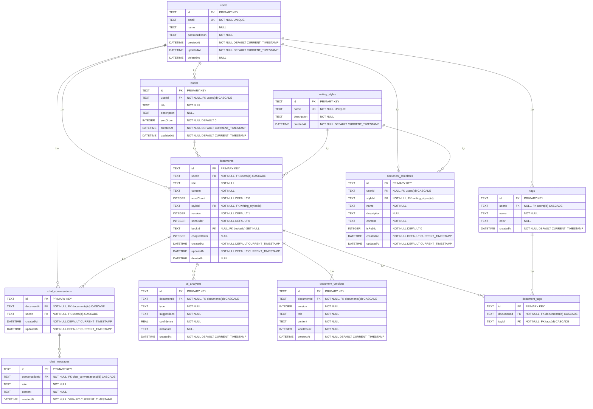

# MPD (Modèle Physique de Données) - MERISE

**Application :** Alfred - Assistant d'écriture IA  
**Date :** 2025-01-13  
**Version :** 2.0 — mise à jour 2026-02-12  
**SGBD :** SQLite 3 (Prisma ORM)

---

## Modèle Physique de Données

Le MPD représente l'implémentation physique de la base de données dans SQLite. Il définit la structure exacte des tables, colonnes, types de données, contraintes et index.

---

## Schéma MPD MERISE



---

## Script SQL de création

```sql
PRAGMA foreign_keys = ON;

-- =========================
-- TABLE users
-- =========================
CREATE TABLE users (
  id           TEXT PRIMARY KEY,                        -- CUID
  email        TEXT NOT NULL UNIQUE,
  name         TEXT,                                    -- Nom affiché, optionnel
  passwordHash TEXT NOT NULL,
  createdAt    DATETIME NOT NULL DEFAULT (CURRENT_TIMESTAMP),
  updatedAt    DATETIME NOT NULL DEFAULT (CURRENT_TIMESTAMP),
  deletedAt    DATETIME                                 -- NULL = actif, NOT NULL = supprimé
);

CREATE INDEX idx_users_email ON users(email);

-- =========================
-- TABLE writing_styles
-- =========================
CREATE TABLE writing_styles (
  id          TEXT PRIMARY KEY,                         -- CUID
  name        TEXT NOT NULL UNIQUE,
  description TEXT NOT NULL,
  createdAt   DATETIME NOT NULL DEFAULT (CURRENT_TIMESTAMP)
);

-- =========================
-- TABLE books
-- =========================
CREATE TABLE books (
  id         TEXT PRIMARY KEY,                          -- CUID
  userId     TEXT NOT NULL,
  title      TEXT NOT NULL,
  description TEXT,
  sortOrder  INTEGER NOT NULL DEFAULT 0,
  createdAt  DATETIME NOT NULL DEFAULT (CURRENT_TIMESTAMP),
  updatedAt  DATETIME NOT NULL DEFAULT (CURRENT_TIMESTAMP),

  FOREIGN KEY (userId) REFERENCES users(id) ON DELETE CASCADE
);

-- =========================
-- TABLE documents
-- =========================
CREATE TABLE documents (
  id           TEXT PRIMARY KEY,                        -- CUID
  userId       TEXT NOT NULL,
  title        TEXT NOT NULL,
  content      TEXT NOT NULL,
  wordCount    INTEGER NOT NULL DEFAULT 0,
  styleId      TEXT NOT NULL,
  version      INTEGER NOT NULL DEFAULT 1,
  sortOrder    INTEGER NOT NULL DEFAULT 0,
  bookId       TEXT,
  chapterOrder INTEGER,
  createdAt    DATETIME NOT NULL DEFAULT (CURRENT_TIMESTAMP),
  updatedAt    DATETIME NOT NULL DEFAULT (CURRENT_TIMESTAMP),
  deletedAt    DATETIME,                                -- NULL = actif, NOT NULL = en corbeille

  FOREIGN KEY (userId)  REFERENCES users(id)          ON DELETE CASCADE,
  FOREIGN KEY (styleId) REFERENCES writing_styles(id),
  FOREIGN KEY (bookId)  REFERENCES books(id)          ON DELETE SET NULL
);

CREATE INDEX idx_documents_deletedAt         ON documents(deletedAt);
CREATE INDEX idx_documents_userId_deletedAt  ON documents(userId, deletedAt);

-- =========================
-- TABLE tags
-- =========================
CREATE TABLE tags (
  id        TEXT PRIMARY KEY,                           -- CUID
  userId    TEXT,                                       -- NULL = tag système/global
  name      TEXT NOT NULL,
  color     TEXT,
  createdAt DATETIME NOT NULL DEFAULT (CURRENT_TIMESTAMP),

  FOREIGN KEY (userId) REFERENCES users(id) ON DELETE CASCADE
);

-- contrainte d'unicité composite : un user ne peut pas avoir 2 tags avec le même nom
CREATE UNIQUE INDEX idx_tags_user_name ON tags(userId, name);

-- =========================
-- TABLE document_tags (table de liaison DOCUMENT <-> TAG)
-- =========================
CREATE TABLE document_tags (
  id         TEXT PRIMARY KEY,                          -- CUID
  documentId TEXT NOT NULL,
  tagId      TEXT NOT NULL,

  FOREIGN KEY (documentId) REFERENCES documents(id) ON DELETE CASCADE,
  FOREIGN KEY (tagId)      REFERENCES tags(id)      ON DELETE CASCADE
);

-- un document ne peut pas avoir 2 fois le même tag
CREATE UNIQUE INDEX idx_document_tags_document_tag ON document_tags(documentId, tagId);

-- =========================
-- TABLE document_templates
-- =========================
CREATE TABLE document_templates (
  id        TEXT PRIMARY KEY,                           -- CUID
  userId    TEXT,                                       -- NULL = template système/public
  styleId   TEXT NOT NULL,
  name      TEXT NOT NULL,
  description TEXT,
  content   TEXT NOT NULL,
  isPublic  INTEGER NOT NULL DEFAULT 0,                 -- 0 = false, 1 = true
  createdAt DATETIME NOT NULL DEFAULT (CURRENT_TIMESTAMP),
  updatedAt DATETIME NOT NULL DEFAULT (CURRENT_TIMESTAMP),

  FOREIGN KEY (userId)  REFERENCES users(id)          ON DELETE CASCADE,
  FOREIGN KEY (styleId) REFERENCES writing_styles(id)
);

-- =========================
-- TABLE chat_conversations
-- =========================
CREATE TABLE chat_conversations (
  id         TEXT PRIMARY KEY,                          -- CUID
  documentId TEXT NOT NULL,
  userId     TEXT NOT NULL,
  createdAt  DATETIME NOT NULL DEFAULT (CURRENT_TIMESTAMP),
  updatedAt  DATETIME NOT NULL DEFAULT (CURRENT_TIMESTAMP),

  FOREIGN KEY (documentId) REFERENCES documents(id) ON DELETE CASCADE,
  FOREIGN KEY (userId)     REFERENCES users(id)     ON DELETE CASCADE
);

-- =========================
-- TABLE chat_messages
-- =========================
CREATE TABLE chat_messages (
  id             TEXT PRIMARY KEY,                      -- CUID
  conversationId TEXT NOT NULL,
  role           TEXT NOT NULL,                         -- "user" | "assistant"
  content        TEXT NOT NULL,
  createdAt      DATETIME NOT NULL DEFAULT (CURRENT_TIMESTAMP),

  FOREIGN KEY (conversationId) REFERENCES chat_conversations(id) ON DELETE CASCADE
);

-- =========================
-- TABLE document_versions
-- =========================
CREATE TABLE document_versions (
  id         TEXT PRIMARY KEY,                          -- CUID
  documentId TEXT NOT NULL,
  version    INTEGER NOT NULL,
  title      TEXT NOT NULL,
  content    TEXT NOT NULL,
  wordCount  INTEGER NOT NULL,
  createdAt  DATETIME NOT NULL DEFAULT (CURRENT_TIMESTAMP),

  FOREIGN KEY (documentId) REFERENCES documents(id) ON DELETE CASCADE
);

-- un document ne peut pas avoir deux fois la même version
CREATE UNIQUE INDEX idx_document_versions_document_version
  ON document_versions(documentId, version);

-- =========================
-- TABLE ai_analyses
-- =========================
CREATE TABLE ai_analyses (
  id         TEXT PRIMARY KEY,                          -- CUID
  documentId TEXT NOT NULL,
  type       TEXT NOT NULL,                             -- "syntax" | "style" | "progression" ...
  suggestions TEXT NOT NULL,                            -- JSON string
  confidence REAL NOT NULL,
  metadata   TEXT,                                      -- JSON string optionnel
  createdAt  DATETIME NOT NULL DEFAULT (CURRENT_TIMESTAMP),

  FOREIGN KEY (documentId) REFERENCES documents(id) ON DELETE CASCADE
);

-- =========================
-- INDEXES SUPPLÉMENTAIRES
-- =========================

-- books
CREATE INDEX idx_books_userId          ON books(userId);
CREATE INDEX idx_books_userId_sortOrder ON books(userId, sortOrder);

-- documents
CREATE INDEX idx_documents_userId          ON documents(userId);
CREATE INDEX idx_documents_styleId         ON documents(styleId);
CREATE INDEX idx_documents_userId_sortOrder ON documents(userId, sortOrder);
CREATE INDEX idx_documents_bookId          ON documents(bookId);
CREATE INDEX idx_documents_bookId_chapterOrder ON documents(bookId, chapterOrder);

-- tags
CREATE INDEX idx_tags_userId ON tags(userId);

-- document_tags
CREATE INDEX idx_document_tags_documentId ON document_tags(documentId);
CREATE INDEX idx_document_tags_tagId      ON document_tags(tagId);

-- document_templates
CREATE INDEX idx_document_templates_styleId  ON document_templates(styleId);
CREATE INDEX idx_document_templates_userId   ON document_templates(userId);
CREATE INDEX idx_document_templates_isPublic ON document_templates(isPublic);

-- chat_conversations
CREATE INDEX idx_chat_conversations_documentId ON chat_conversations(documentId);
CREATE INDEX idx_chat_conversations_userId     ON chat_conversations(userId);

-- chat_messages
CREATE INDEX idx_chat_messages_conversationId              ON chat_messages(conversationId);
CREATE INDEX idx_chat_messages_conversationId_createdAt    ON chat_messages(conversationId, createdAt);

-- document_versions
CREATE INDEX idx_document_versions_documentId          ON document_versions(documentId);

-- ai_analyses
CREATE INDEX idx_ai_analyses_documentId ON ai_analyses(documentId);
```

---

## Structure des tables

### Table `users`

| Colonne | Type | Contraintes | Description |
|---------|------|-------------|-------------|
| id | TEXT | PRIMARY KEY | Identifiant unique (CUID) |
| email | TEXT | NOT NULL, UNIQUE | Adresse email unique |
| name | TEXT | NULL | Nom affiché (optionnel) |
| passwordHash | TEXT | NOT NULL | Hash bcrypt du mot de passe |
| createdAt | DATETIME | NOT NULL, DEFAULT CURRENT_TIMESTAMP | Date de création |
| updatedAt | DATETIME | NOT NULL, DEFAULT CURRENT_TIMESTAMP | Date de modification |
| deletedAt | DATETIME | NULL | Suppression logique (NULL = actif) |

**Index :**
- `idx_users_email` : Index sur `email` (optimise les recherches de connexion)

---

### Table `writing_styles`

| Colonne | Type | Contraintes | Description |
|---------|------|-------------|-------------|
| id | TEXT | PRIMARY KEY | Identifiant unique (CUID) |
| name | TEXT | NOT NULL, UNIQUE | Nom du style d'écriture |
| description | TEXT | NOT NULL | Description du style |
| createdAt | DATETIME | NOT NULL, DEFAULT CURRENT_TIMESTAMP | Date de création |

**Index :** Aucun index supplémentaire (clé primaire et UNIQUE automatiques)

---

### Table `books`

| Colonne | Type | Contraintes | Description |
|---------|------|-------------|-------------|
| id | TEXT | PRIMARY KEY | Identifiant unique (CUID) |
| userId | TEXT | NOT NULL, FK → users(id) | Propriétaire du livre |
| title | TEXT | NOT NULL | Titre du livre |
| description | TEXT | NULL | Description optionnelle |
| sortOrder | INTEGER | NOT NULL, DEFAULT 0 | Ordre d'affichage |
| createdAt | DATETIME | NOT NULL, DEFAULT CURRENT_TIMESTAMP | Date de création |
| updatedAt | DATETIME | NOT NULL, DEFAULT CURRENT_TIMESTAMP | Date de modification |

**Clés étrangères :**
- `userId` → `users(id)` ON DELETE CASCADE

**Index :**
- `idx_books_userId` : Index sur `userId`
- `idx_books_userId_sortOrder` : Index composite sur `(userId, sortOrder)`

---

### Table `documents`

| Colonne | Type | Contraintes | Description |
|---------|------|-------------|-------------|
| id | TEXT | PRIMARY KEY | Identifiant unique (CUID) |
| userId | TEXT | NOT NULL, FK → users(id) | Propriétaire du document |
| title | TEXT | NOT NULL | Titre du document |
| content | TEXT | NOT NULL | Contenu textuel |
| wordCount | INTEGER | NOT NULL, DEFAULT 0 | Nombre de mots |
| styleId | TEXT | NOT NULL, FK → writing_styles(id) | Style d'écriture |
| version | INTEGER | NOT NULL, DEFAULT 1 | Numéro de version |
| sortOrder | INTEGER | NOT NULL, DEFAULT 0 | Ordre d'affichage |
| bookId | TEXT | NULL, FK → books(id) | Livre parent (optionnel) |
| chapterOrder | INTEGER | NULL | Ordre du chapitre dans le livre |
| createdAt | DATETIME | NOT NULL, DEFAULT CURRENT_TIMESTAMP | Date de création |
| updatedAt | DATETIME | NOT NULL, DEFAULT CURRENT_TIMESTAMP | Date de modification |
| deletedAt | DATETIME | NULL | Suppression logique / corbeille (NULL = actif) |

**Clés étrangères :**
- `userId` → `users(id)` ON DELETE CASCADE
- `styleId` → `writing_styles(id)`
- `bookId` → `books(id)` ON DELETE SET NULL

**Index :**
- `idx_documents_userId` : Index sur `userId`
- `idx_documents_styleId` : Index sur `styleId`
- `idx_documents_userId_sortOrder` : Index composite sur `(userId, sortOrder)`
- `idx_documents_bookId` : Index sur `bookId`
- `idx_documents_bookId_chapterOrder` : Index composite sur `(bookId, chapterOrder)`
- `idx_documents_deletedAt` : Index sur `deletedAt` (filtrage corbeille)
- `idx_documents_userId_deletedAt` : Index composite sur `(userId, deletedAt)` (liste active/corbeille par user)

---

### Table `tags`

| Colonne | Type | Contraintes | Description |
|---------|------|-------------|-------------|
| id | TEXT | PRIMARY KEY | Identifiant unique (CUID) |
| userId | TEXT | NULL, FK → users(id) | Propriétaire (NULL = tag système) |
| name | TEXT | NOT NULL | Nom du tag |
| color | TEXT | NULL | Couleur hexadécimale |
| createdAt | DATETIME | NOT NULL, DEFAULT CURRENT_TIMESTAMP | Date de création |

**Clés étrangères :**
- `userId` → `users(id)` ON DELETE CASCADE

**Index :**
- `idx_tags_userId` : Index sur `userId`
- `idx_tags_user_name` : Index UNIQUE composite sur `(userId, name)`

---

### Table `document_tags`

| Colonne | Type | Contraintes | Description |
|---------|------|-------------|-------------|
| id | TEXT | PRIMARY KEY | Identifiant unique (CUID) |
| documentId | TEXT | NOT NULL, FK → documents(id) | Document tagué |
| tagId | TEXT | NOT NULL, FK → tags(id) | Tag associé |

**Clés étrangères :**
- `documentId` → `documents(id)` ON DELETE CASCADE
- `tagId` → `tags(id)` ON DELETE CASCADE

**Index :**
- `idx_document_tags_documentId` : Index sur `documentId`
- `idx_document_tags_tagId` : Index sur `tagId`
- `idx_document_tags_document_tag` : Index UNIQUE composite sur `(documentId, tagId)`

---

### Table `document_templates`

| Colonne | Type | Contraintes | Description |
|---------|------|-------------|-------------|
| id | TEXT | PRIMARY KEY | Identifiant unique (CUID) |
| userId | TEXT | NULL, FK → users(id) | Propriétaire (NULL = template système) |
| styleId | TEXT | NOT NULL, FK → writing_styles(id) | Style d'écriture |
| name | TEXT | NOT NULL | Nom du template |
| description | TEXT | NULL | Description optionnelle |
| content | TEXT | NOT NULL | Contenu du template |
| isPublic | INTEGER | NOT NULL, DEFAULT 0 | Template public (0=false, 1=true) |
| createdAt | DATETIME | NOT NULL, DEFAULT CURRENT_TIMESTAMP | Date de création |
| updatedAt | DATETIME | NOT NULL, DEFAULT CURRENT_TIMESTAMP | Date de modification |

**Clés étrangères :**
- `userId` → `users(id)` ON DELETE CASCADE
- `styleId` → `writing_styles(id)`

**Index :**
- `idx_document_templates_styleId` : Index sur `styleId`
- `idx_document_templates_userId` : Index sur `userId`
- `idx_document_templates_isPublic` : Index sur `isPublic`

---

### Table `chat_conversations`

| Colonne | Type | Contraintes | Description |
|---------|------|-------------|-------------|
| id | TEXT | PRIMARY KEY | Identifiant unique (CUID) |
| documentId | TEXT | NOT NULL, FK → documents(id) | Document de la conversation |
| userId | TEXT | NOT NULL, FK → users(id) | Utilisateur participant |
| createdAt | DATETIME | NOT NULL, DEFAULT CURRENT_TIMESTAMP | Date de création |
| updatedAt | DATETIME | NOT NULL, DEFAULT CURRENT_TIMESTAMP | Date de modification |

**Clés étrangères :**
- `documentId` → `documents(id)` ON DELETE CASCADE
- `userId` → `users(id)` ON DELETE CASCADE

**Index :**
- `idx_chat_conversations_documentId` : Index sur `documentId`
- `idx_chat_conversations_userId` : Index sur `userId`

---

### Table `chat_messages`

| Colonne | Type | Contraintes | Description |
|---------|------|-------------|-------------|
| id | TEXT | PRIMARY KEY | Identifiant unique (CUID) |
| conversationId | TEXT | NOT NULL, FK → chat_conversations(id) | Conversation parente |
| role | TEXT | NOT NULL | Rôle ("user" ou "assistant") |
| content | TEXT | NOT NULL | Contenu du message |
| createdAt | DATETIME | NOT NULL, DEFAULT CURRENT_TIMESTAMP | Date d'envoi |

**Clés étrangères :**
- `conversationId` → `chat_conversations(id)` ON DELETE CASCADE

**Index :**
- `idx_chat_messages_conversationId` : Index sur `conversationId`
- `idx_chat_messages_conversationId_createdAt` : Index composite sur `(conversationId, createdAt)`

---

### Table `document_versions`

| Colonne | Type | Contraintes | Description |
|---------|------|-------------|-------------|
| id | TEXT | PRIMARY KEY | Identifiant unique (CUID) |
| documentId | TEXT | NOT NULL, FK → documents(id) | Document parent |
| version | INTEGER | NOT NULL | Numéro de version |
| title | TEXT | NOT NULL | Snapshot du titre |
| content | TEXT | NOT NULL | Snapshot du contenu |
| wordCount | INTEGER | NOT NULL | Nombre de mots à cette version |
| createdAt | DATETIME | NOT NULL, DEFAULT CURRENT_TIMESTAMP | Date de création |

**Clés étrangères :**
- `documentId` → `documents(id)` ON DELETE CASCADE

**Index :**
- `idx_document_versions_documentId` : Index sur `documentId`
- `idx_document_versions_document_version` : Index UNIQUE composite sur `(documentId, version)`

---

### Table `ai_analyses`

| Colonne | Type | Contraintes | Description |
|---------|------|-------------|-------------|
| id | TEXT | PRIMARY KEY | Identifiant unique (CUID) |
| documentId | TEXT | NOT NULL, FK → documents(id) | Document analysé |
| type | TEXT | NOT NULL | Type ("syntax", "style", "progression") |
| suggestions | TEXT | NOT NULL | Suggestions JSON |
| confidence | REAL | NOT NULL | Niveau de confiance (0.0 à 1.0) |
| metadata | TEXT | NULL | Métadonnées JSON optionnelles |
| createdAt | DATETIME | NOT NULL, DEFAULT CURRENT_TIMESTAMP | Date de création |

**Clés étrangères :**
- `documentId` → `documents(id)` ON DELETE CASCADE

**Index :**
- `idx_ai_analyses_documentId` : Index sur `documentId`

---

## Règles d'intégrité référentielle

### Suppression en cascade (ON DELETE CASCADE)

Les enregistrements enfants sont automatiquement supprimés lors de la suppression du parent :

- Suppression d'un `user` → Suppression de ses `books`, `documents`, `tags`, `document_templates`, `chat_conversations` (suppression physique si le compte est purgé)
- Suppression d'un `document` → Suppression de ses `ai_analyses`, `chat_conversations`, `document_versions`, `document_tags`
- Suppression d'un `book` → Les `documents` associés voient leur `bookId` mis à NULL (SET NULL)
- Suppression d'un `tag` → Suppression des `document_tags` associés
- Suppression d'une `chat_conversation` → Suppression de ses `chat_messages`

### Mise à NULL (ON DELETE SET NULL)

- Suppression d'un `book` → `documents.bookId` est mis à NULL (le document devient indépendant)

---

## Types de données SQLite

| Type SQLite | Description | Utilisation |
|-------------|-------------|-------------|
| TEXT | Chaîne de caractères | CUID, emails, titres, contenus, JSON |
| INTEGER | Entier signé | Compteurs, versions, ordres, booléens (0/1) |
| REAL | Nombre décimal | Niveaux de confiance, pourcentages |
| DATETIME | Date et heure | Timestamps (stocké en TEXT dans SQLite) |

---

## Index et performances

### Index primaires
Toutes les tables ont un index primaire automatique sur la colonne `id` (TEXT).

### Index uniques
- `users.email` : UNIQUE
- `writing_styles.name` : UNIQUE
- `tags(userId, name)` : UNIQUE composite
- `document_tags(documentId, tagId)` : UNIQUE composite
- `document_versions(documentId, version)` : UNIQUE composite

### Index de performance
27 index supplémentaires pour optimiser les requêtes fréquentes :
- Recherche par utilisateur
- Tri par ordre d'affichage
- Filtrage par livre et chapitre
- Recherche de messages par conversation
- Filtrage de templates publics

---

## Configuration SQLite

### PRAGMA foreign_keys

Le script active les clés étrangères avec :
```sql
PRAGMA foreign_keys = ON;
```

Cette directive est nécessaire pour que SQLite respecte les contraintes de clés étrangères.

---

## Notes d'implémentation

### Identifiants (CUID)
Tous les identifiants utilisent le format CUID (Collision-resistant Unique Identifier), stockés en TEXT.

### Booléens
Les valeurs booléennes sont stockées comme INTEGER :
- `0` = false
- `1` = true

Exemple : `document_templates.isPublic`

### JSON
Les données JSON sont stockées en TEXT et parsées côté application :
- `ai_analyses.suggestions` : Tableau JSON
- `ai_analyses.metadata` : Objet JSON optionnel

### Timestamps
Les colonnes `createdAt` et `updatedAt` utilisent `CURRENT_TIMESTAMP` comme valeur par défaut. SQLite met à jour automatiquement `updatedAt` via un trigger (géré par Prisma).

---

## Compatibilité avec Prisma

Ce script SQL est compatible avec le schéma Prisma défini dans `prisma/schema.prisma`. Les noms de colonnes et de tables correspondent exactement aux mappings Prisma (`@@map`).

---

**Document généré le :** 2025-01-13  
**Dernière mise à jour :** 2026-02-12  
**Version du schéma :** 2.0
